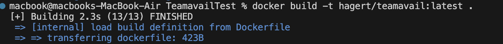
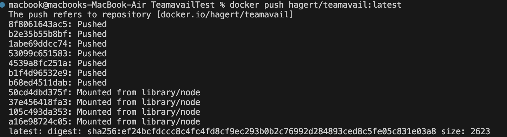
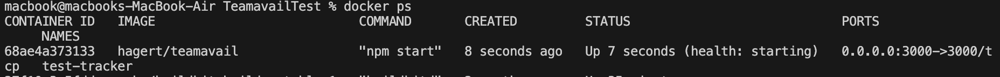
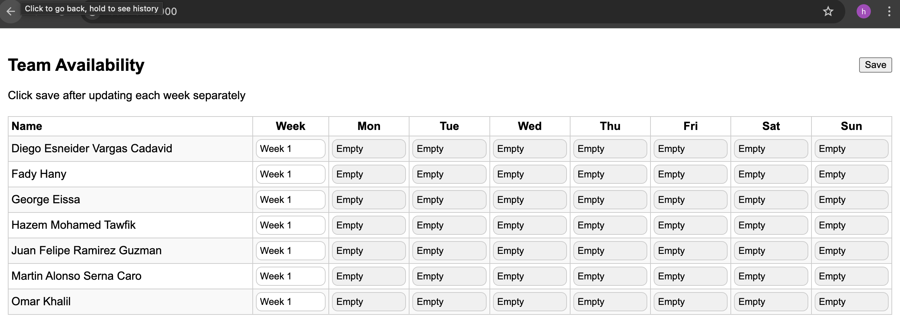
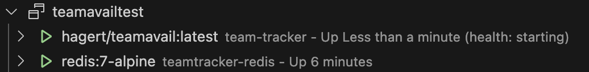
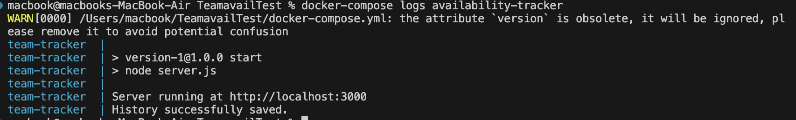
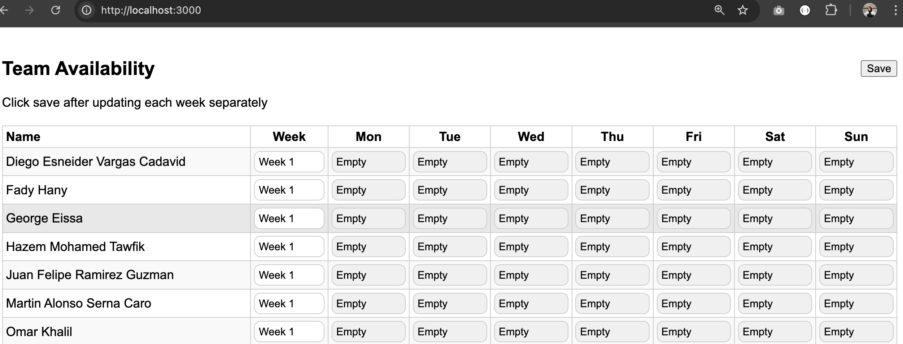
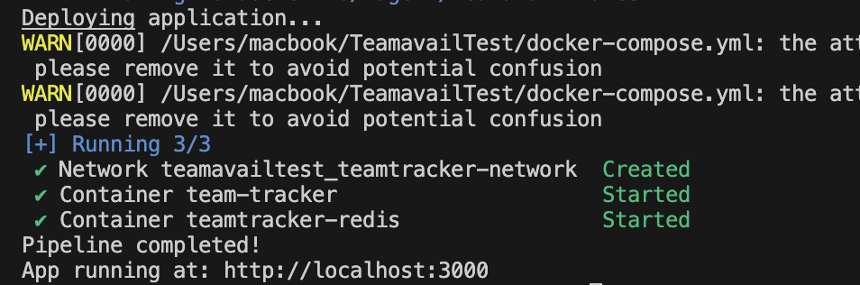

# Team Availability Tracker - CI/CD Pipeline Implementation

## Project Overview

This project implements a comprehensive CI/CD pipeline for a Node.js-based team availability tracking application. The pipeline automates code quality checks, testing, containerization, and deployment processes using industry-standard DevOps tools and practices.

## Project Structure

```
TeamavailTest/
├── input/                     # Input data files
├── output/                    # Generated output files
│   └── history.json          # Application history data
├── public/                   # Static frontend files
├── scripts/                  # Utility scripts
├── test/                     # Test files directory
├── .eslintrc.json           # ESLint configuration
├── .gitignore               # Git ignore rules
├── .prettierrc              # Prettier configuration
├── docker-compose.yml       # Multi-container orchestration
├── Dockerfile              # Container build instructions
├── Jenkinsfile             # Jenkins pipeline configuration
├── package.json            # Node.js dependencies and scripts
├── server.js               # Main application server
└── README.md               # Project documentation
```

### Step 1: Install Dependencies

```bash
npm install
```

## Running the Application

### Method 1: Local Development

```bash
npm start
```


### Method 2: Docker Containerization

```bash
docker build -t hagert/teamavail:latest .
```

```bash
docker run -p 3000:3000 hagert/teamavail:latest
```


```bash
to check >> docker ps 
```



**Access**: http://localhost:3000



**Key Features**:
- Uses Alpine Linux for minimal image size
- Copies package files first for better layer caching
- Uses `npm ci` for reproducible builds
- Exposes port 3000 for external access


### Method 3: Full Stack with Docker Compose

```bash
docker-compose up -d
```
to check 






**Purpose**: Starts the complete application stack including the Node.js application and Redis database in separate containers.

**Application Service**:
- Builds from local Dockerfile
- Maps port 3000 to host
- Mounts input/output directories
- Depends on Redis service

**Redis Service**:
- Uses official Redis Alpine image
- Provides caching and session storage
- Persists data using Docker volumes

## CI/CD Pipeline

### Automated Pipeline Script

```bash
chmod +x ci.sh
./ci.sh
```



**Purpose**: Executes the complete CI/CD pipeline which includes:

1. **Dependency Installation**: Downloads and installs all required packages
2. **Code Quality Checks**: Runs linting and formatting validation
3. **Testing**: Executes the test suite to verify application functionality
4. **Build**: Creates a Docker image of the application
5. **Deployment**: Starts the application using Docker Compose


### Jenkins Integration

For enterprise environments, Jenkins pipeline support is included:

**Pipeline Stages**:
- Source code checkout
- Dependency installation
- Quality gates
- Build processes
- Deployment automation

## Configuration Files

### ESLint (.eslintrc.json)
**Purpose**: Enforces JavaScript code quality standards and catches common errors.

### Prettier (.prettierrc)
**Purpose**: Maintains consistent code formatting across the project.

### Jest (jest.config.js)
**Purpose**: Configures the testing framework with appropriate settings for Node.js applications.

### Git (.gitignore)
**Purpose**: Excludes unnecessary files from version control including node_modules, logs, and build artifacts.

