# Team Availability Tracker - CI/CD Pipeline Implementation

## Project Overview

This project implements a comprehensive CI/CD pipeline for a Node.js-based team availability tracking application. The pipeline automates code quality checks, testing, containerization, and deployment processes using industry-standard DevOps tools and practices.

## Project Structure

```
TeamavailTest/
├── input/                     # Input data files
├── output/                    # Generated output files
│   └── history.json          # Application history data
├── public/                   # Static frontend files
├── scripts/                  # Utility scripts
├── test/                     # Test files directory
├── .eslintrc.json           # ESLint configuration
├── .gitignore               # Git ignore rules
├── .prettierrc              # Prettier configuration
├── docker-compose.yml       # Multi-container orchestration
├── Dockerfile              # Container build instructions
├── Jenkinsfile             # Jenkins pipeline configuration
├── package.json            # Node.js dependencies and scripts
├── server.js               # Main application server
└── README.md               # Project documentation
```

### Step 1: Install Dependencies

```bash
npm install
```

## Running the Application

### Method 1: Local Development

```bash
npm start
```


### Method 2: Docker Containerization

```bash
docker build -t hagert/teamavail:latest .
```

```bash
docker run -p 3000:3000 hagert/teamavail:latest
```


```bash
to check >> docker ps 
```


**Access**: http://localhost:3000


**Key Features**:
- Uses Alpine Linux for minimal image size
- Copies package files first for better layer caching
- Uses `npm ci` for reproducible builds
- Exposes port 3000 for external access


### Method 3: Full Stack with Docker Compose

```bash
docker-compose up -d
```
to check 


**Purpose**: Starts the complete application stack including the Node.js application and Redis database in separate containers.

**Application Service**:
- Builds from local Dockerfile
- Maps port 3000 to host
- Mounts input/output directories
- Depends on Redis service

**Redis Service**:
- Uses official Redis Alpine image
- Provides caching and session storage
- Persists data using Docker volumes

## CI/CD Pipeline

### Automated Pipeline Script

```bash
chmod +x ci.sh
./ci.sh
```


**Purpose**: Executes the complete CI/CD pipeline which includes:

1. **Dependency Installation**: Downloads and installs all required packages
2. **Code Quality Checks**: Runs linting and formatting validation

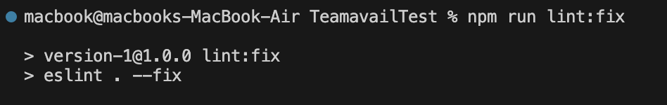

3. **Testing**: Executes the test suite to verify application functionality

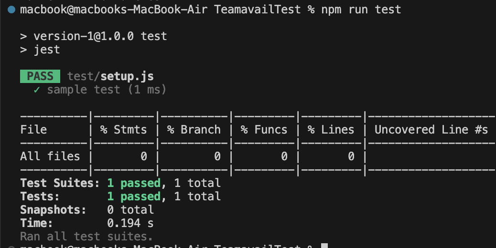

4. **Build**: Creates a Docker image of the application
5. **Deployment**: Starts the application using Docker Compose


### Jenkins Integration

For enterprise environments, Jenkins pipeline support is included:

**Pipeline Stages**:
- Source code checkout
- Dependency installation
- Quality gates
- Build processes
- Deployment automation

## Configuration Files

### ESLint (.eslintrc.json)
**Purpose**: Enforces JavaScript code quality standards and catches common errors.

### Jest (jest.config.js)
**Purpose**: Configures the testing framework with appropriate settings for Node.js applications.

---

# Phase 2: AWS + Jenkins + Terraform + Ansible Complete Guide

## Project Overview

**Goal**: Deploy the availability tracker application to AWS using DevOps tools.
**Tools**: Jenkins, Terraform, Ansible, AWS (VPC, EC2, ECR, ElastiCache).
**Flow**: GitHub → Jenkins → Terraform → AWS → Ansible → Deployed App.

---

## Architecture

```
Developer → GitHub → Jenkins → Terraform → AWS Infrastructure
                                     ↓
GitHub Webhook → Jenkins Pipeline → Ansible → Configure EC2 → Deploy App
```

**AWS Resources Created:**

* VPC with subnets
* EC2 instance(s) for the app
* ECR for Docker images
* ElastiCache (Redis)
* Security Groups
* Application Load Balancer (ALB)

---

## Project Structure

```
TeamavailTest/
├── terraform/
│   ├── main.tf
│   ├── variables.tf
│   ├── outputs.tf
│   ├── vpc.tf
│   ├── ec2.tf
│   ├── ecr.tf
│   ├── redis.tf
│   └── security.tf
├── ansible/
│   ├── inventory/
│   │   └── aws_ec2.yml
│   ├── playbooks/
│   │   ├── setup-docker.yml
│   │   ├── deploy-app.yml
│   │   └── site.yml
│   └── ansible.cfg
├── jenkins/
│   └── Jenkinsfile
├── docker-compose.aws.yml
└── README-Phase2.md
```

---

## Step-by-Step Implementation

### Step 1: AWS & Local Setup

1. Installed AWS CLI and configured credentials (`aws configure`).
2. Installed Terraform.
3. Installed Ansible and AWS Ansible Collection.
4. Verified configuration by running:

---

### Step 2: Infrastructure with Terraform

1. Created `variables.tf` with project settings like region, environment, and instance type.
2. Created `main.tf` to define providers and data sources (AMIs, availability zones).
3. Created `vpc.tf` to define the VPC, subnets, internet gateway, and route tables.

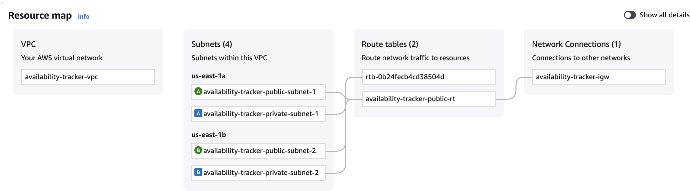

4. Created `security.tf` to define Security Groups for ALB, EC2, and Redis.
5. Created `ecr.tf` to provision an ECR repository with lifecycle policy.

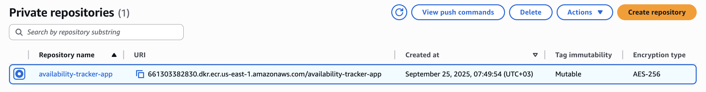

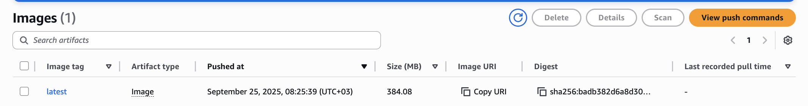


6. Created `redis.tf` to set up ElastiCache Redis cluster and subnet group.

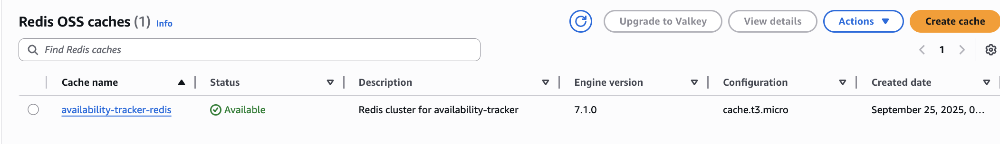

7. Created `ec2.tf` for EC2 Auto Scaling Group, Launch Template, and ALB with listener.
8. Added `user_data.sh` to bootstrap EC2 with Docker and AWS CLI.

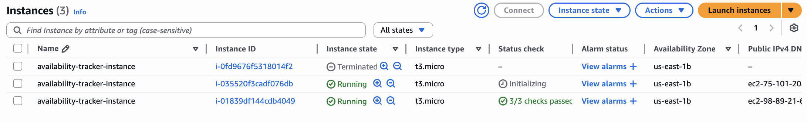

9. Added `outputs.tf` to expose useful values like ALB DNS, Redis endpoint, and ECR URL.

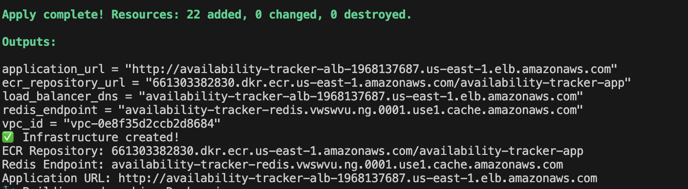

---

### Step 3: Configuration with Ansible

1. Configured `ansible.cfg` to use AWS EC2 dynamic inventory.
2. Created `inventory/aws_ec2.yml` for inventory based on tags.
3. Created `setup-docker.yml` playbook to install Docker, Docker Compose, and login to ECR.
4. Created `deploy-app.yml` playbook to pull the image, create a docker-compose file, and deploy the app.
5. Created `site.yml` to combine setup and deploy steps.
6. Created `docker-compose.aws.yml.j2` template with Redis environment variables.


---

### Step 4: Jenkins Pipeline

1. Configured Jenkins with GitHub Webhook.

   * Used **ngrok** to expose local Jenkins to GitHub for testing.
    1-
   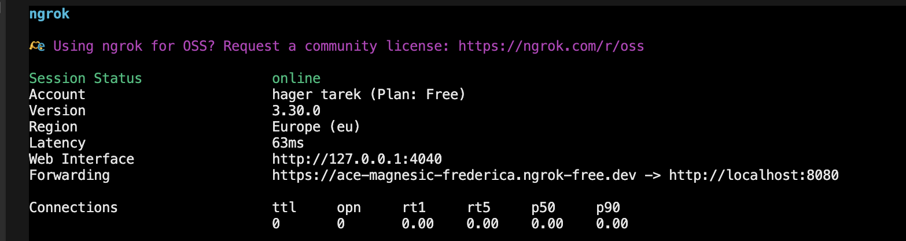

   2-
   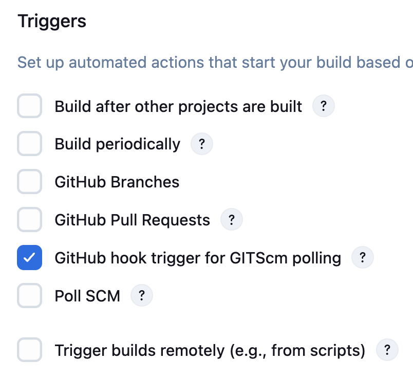


   * Added the webhook in GitHub repo settings.

      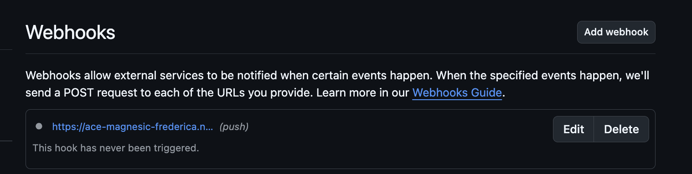

2. Created `Jenkinsfile` with stages:

   * Checkout code from GitHub.
   * Build and push Docker image to ECR.
   * Terraform init, plan, and apply (on main branch).
   * Deploy with Ansible (site.yml).
   * Health check to validate the app.
3. Jenkins pipeline triggered automatically on push via webhook.


---


